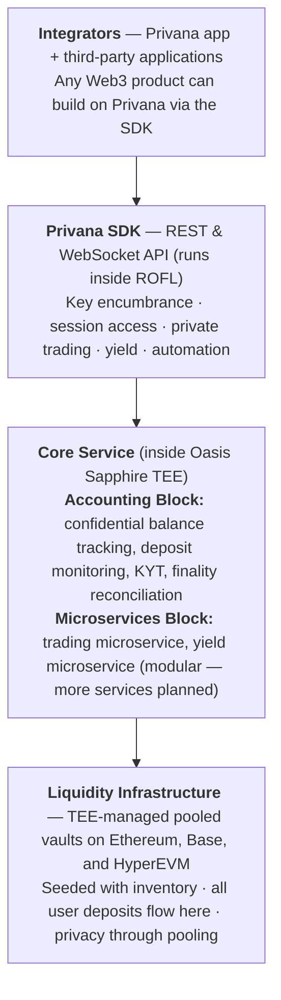

The full Privana architecture, from the layers that make it up to the components that handle your trades and policies.

The Privana architecture has four principal layers: integrators (the Privana app and third-party applications), the SDK interface, the liquidity infrastructure, and the core service. Here's how they fit together.

### The accounting block

The accounting block is a set of Oasis Sapphire confidential smart contracts that function as the system's internal state. It maintains a confidential mapping of deposit addresses to asset balances and handles deposit monitoring, balance registration, transaction screening (KYT), balance validation before trades, routing of validated intents to the correct microservice, finality reconciliation after trade execution, and withdrawal processing across all supported chains.

### The microservices block

The microservices block implements the execution logic for DeFi operations. For the MVP, two microservices are provided: trading and yield (covered in the [Private Swaps](../features/private-swaps.md) and [Idle Yield](../features/idle-yield.md) sections). The modular architecture is designed for horizontal expansion — additional microservices like perpetuals trading or lending can be added without modifying the core accounting logic, and each new service automatically inherits the same key-encumbrance and privacy guarantees.

### Remote attestation

Attestation reports, signed by Intel's hardware root of trust, allow you to verify remotely that the enclave is running exactly the code it claims to be running. This means you don't need to trust Privana's word about what code is executing — you can cryptographically verify it. This is a stronger guarantee than an audit alone can provide.

### What Privana enables beyond DeFi

Because Privana exposes a composable SDK, it's not limited to DeFi applications. Any Web3 product that needs privacy, session-based access, or automated policy execution can integrate it. The Oasis team is also developing a gaming application that uses Privana to let players transact with real assets without signing each action — time-bounded access-control policies create a seamless experience comparable to Web2 gaming.
