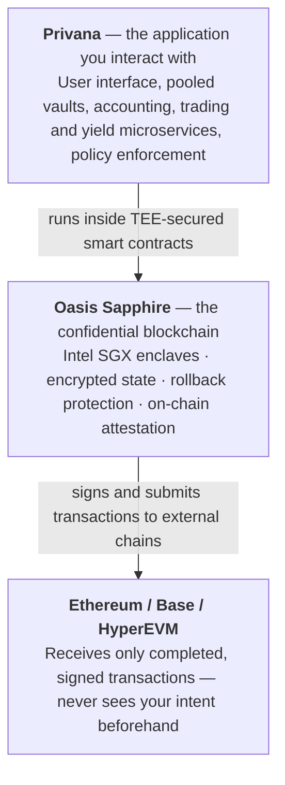

Privana runs on Oasis Sapphire, a confidential blockchain. Here's how the two layers fit together.

Understanding Privana means understanding how the two layers work together. Each layer has a distinct role, and the privacy and security guarantees flow upward from the bottom.

**Oasis Sapphire** is a blockchain built by the [Oasis Network](https://oasis.net/). What makes it special is that every smart contract on Sapphire runs inside a hardware enclave (a TEE). Contract storage is encrypted. Even the validators running the network can't read what's inside a contract. This is the confidential foundation everything else is built on. [Learn more about Oasis Sapphire →](https://docs.oasis.io/dapp/sapphire/)

**Privana** is the consumer-facing DeFi application built on Oasis Sapphire by the Oasis team. It's where you actually interact — connect your wallet, deposit assets, execute swaps, set up automation rules, and manage your portfolio.

:::tip[Why this matters]

The privacy and security guarantees you get in Privana aren't implemented by Privana alone — they come from Oasis Sapphire's confidential smart contracts. This means the guarantees are enforced at the hardware and blockchain level, not just at the application level.

:::
